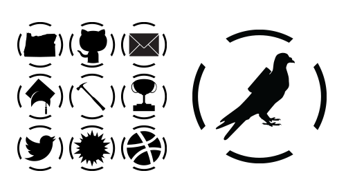

This icon set is meant to be irreverent and fun. With a carrier pigeon for contact pages, this likely isn't a one-stop-shop for your icon needs. However, if you're looking for something with a little whimsy and just enough SVG to animate, this icon set is perfect, and I'm always adding to it.

You can see the icons in use on this site, and grab them all from [GitHub](https://github.com/astuteape/astute-icons)

If you notice an issue with any of the SVGs or have an icon request, please submit a GitHub Issue.
