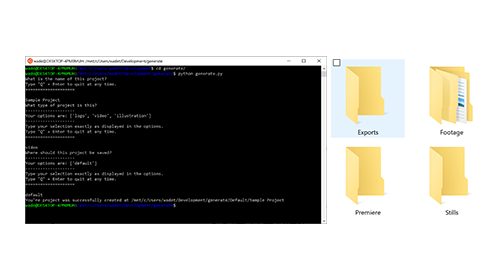

This command line application _generates_ a project folder structure that you define and reuse. A more feature-rich version of this app is used multiple times each week to automate video project creation at Treehouse.

For instructions and more information, [view the project on GitHub](https://github.com/astuteape/generate).
